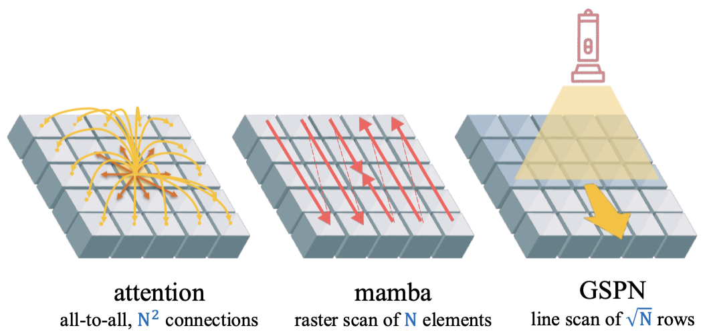
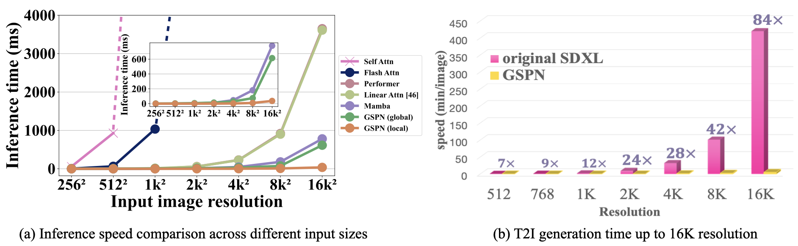

<div align="center">

<p align="center" style="border-radius: 10px">
  
</p>

<a href="https://arxiv.org/abs/2501.12381"></a> 
<a href="https://whj363636.github.io/GSPN/"></a>
<a href="#jump"></a>
</div>


> **[CVPR 2025] Parallel Sequence Modeling via Generalized Spatial Propagation Network**
> <br>
> [Hongjun Wang](https://whj363636.github.io/), 
> [Wonmin Byeon](https://wonmin-byeon.github.io/), 
> [Jiarui Xu](https://jerryxu.net/), 
> [Jinwei Gu](https://www.gujinwei.org/), 
> [Ka Chun Cheung](https://developer.nvidia.com/blog/author/charles-cheung/), 
> [Xiaolong Wang](https://xiaolonw.github.io/), 
> [Kai Han](https://www.kaihan.org/), 
> [Jan Kautz](https://jankautz.com/), 
> [Sifei Liu](https://sifeiliu.net/)
> <br>
> NVIDIA, The University of Hong Kong, University of California, San Diego



## 🔥 News

- (🔥 New) \[2025/04/19\] We release all the training and inference code of GSPN.
- (🔥 New) \[2025/03/11\] **GSPN is accepted by CVPR 2025.** 🎉🎉🎉
- \[2025/01\] [GSPN Paper](https://arxiv.org/abs/2501.12381) is on Arxiv!

<details>
  <summary>TODOs</summary>

- [ ] Model zoo
- [ ] Further acceleration for GSPN kernel
- [ ] Apply GSPN on more challenging tasks

</details>

## 🏃 Getting Started

### Installation

**Step 1: Clone the GSPN repository:**

To get started, first clone the GSPN repository and navigate to the project directory:

```bash
git clone https://github.com/whj363636/GSPN.git
cd GSPN
```

**Step 2: Environment Setup:**

GSPN recommends setting up a conda environment and installing dependencies via pip. Use the following commands to set up your environment:

***Create and activate a new conda environment***

```bash
conda create -n gspn python=3.10
conda activate gspn
```

***Install Dependencies***

```bash
pip install -r requirements.txt
pip install --no-cache-dir -e .
```

## 🚀 Model Training and Inference

### Overview

GSPN is a general-purpose parallel sequence modeling framework that can be applied to various tasks, including classification, generation, and text-to-image generation.


The speed of GSPN significantly outperforms both traditional self-attention mechanisms and their efficient variants, as well as state-of-the-art parallel sequence modeling frameworks. Our approach enables ultra-high-resolution generation up to 16K on a single A100 GPU while reducing inference time by up to 84× compared to the standard SD-XL model.


### 🗂 Classification

```bash
cd classification
```

#### Data structure
```
imagenet
├── train
│   ├── class1
│   │   ├── img1.jpeg
│   │   ├── img2.jpeg
│   │   └── ...
│   ├── class2
│   │   ├── img3.jpeg
│   │   └── ...
│   └── ...
└── val
    ├── class1
    │   ├── img4.jpeg
    │   ├── img5.jpeg
    │   └── ...
    ├── class2
    │   ├── img6.jpeg
    │   └── ...
    └── ...
```

* To train GSPN models for classification on ImageNet with 8 GPUs on 2 nodes, you can use the following command:

```bash
torchrun --nnodes=2 --nproc_per_node=8 --node_rank=$CURRENT_RANK --master_addr=$YOUR_MASTER_ADDR --master_port=$YOUR_MASTER_PORT main.py --cfg /path/to/config --batch-size 128 --data-path /path/to/imagenet/ --output ../output
```
Replace `cfg` with the configuration file for different sizes (e.g., [`tiny.yaml`](./classification/configs/tiny.yaml), [`small.yaml`](./classification/configs/small.yaml), [`base.yaml`](./classification/configs/base.yaml)). Note that you need to change batch size to 64 for base model.


* To test the performance of GSPN models, you can use the following command:

```bash
torchrun --nnodes=1 --node_rank=0 --nproc_per_node=1 --master_addr=$YOUR_MASTER_ADDR --master_port=$YOUR_MASTER_PORT main.py --cfg /path/to/config --batch-size 128 --data-path /path/to/imagenet/ --output ../output --pretrained /path/of/checkpoint
```

#### Results

| Models                  | Acc@1 | # Params | Mac   | Resolution | Ckpts |
|:-----------------------:|:-----:|:--------:|:-----:|:----------:|:-----:|
| Swin-T (ICCV'21)        | 81.3  | 29M      | 4.5G  | 224x224    | --    |
| VMamba-T (NeurIPS'24)   | 82.2  | 22M      | 5.6G  | 224x224    | --    |
| MambaOut-T (CVPR'25)    | 82.7  | 27M      | 4.5G  | 224x224    | --    |
| MambaVision-T (CVPR'25) | 82.3  | 32M      | 4.4G  | 224x224    | --    |
| GSPN-T (Ours)           | 83.0  | 30M      | 5.3G  | 224x224    | <a href="https://huggingface.co/"></a> |
| GSPN-S (Ours)           | 83.8  | 50M      | 9.0G  | 224x224    | <a href="https://huggingface.co/"></a> |
| GSPN-B (Ours)           | 84.3  | 89M      | 15.9G | 224x224    | <a href="https://huggingface.co/"></a> |

More comprehensive results please refer to the [supplementary](./classification/README.md).


### 🎨 Class-conditional Generation

```bash
cd generation
```

#### Feature Pre-extraction
* To extract ImageNet features with `1` GPUs on one node:

```bash
torchrun --nnodes=1 --nproc_per_node=1 extract_features.py --model GSPN-XL/2 --data-path /path/to/imagenet/train --features-path /path/to/store/features
```

#### Training DiT
We provide a training script for DiT in [`train.py`](./generation/train.py). This script can be used to train class-conditional DiT models, but it can be easily modified to support other types of conditioning. 

* To launch GSPN-XL/2 (256x256) training with `N` GPUs on `M` nodes:

```bash
torchrun --nnodes=M --nproc_per_node=N --node_rank=$CURRENT_RANK --master_addr=$YOUR_MASTER_ADDR --master_port=$YOUR_MASTER_PORT train.py --image-size 256 --global-batch-size 1024 --model GSPN-XL/2 --feature-path /path/to/store/features
```

#### Evaluation (FID, Inception Score, etc.)

We provide a [`sample_ddp.py`](./generation/sample_ddp.py) script for parallel image generation using GSPN class-conditional models. This script outputs both a folder of generated images and a `.npz` file compatible with [ADM's TensorFlow evaluation suite](https://github.com/openai/guided-diffusion/tree/main/evaluations) for computing metrics such as FID, Inception Score, etc. 

* To generate 50K images using our pre-trained GSPN-XL/2 model across `N` GPUs, run:

```bash
torchrun --nnodes=1 --nproc_per_node=N sample_ddp.py --model GSPN-XL/2 --num-fid-samples 50000
```

There are several additional options; see [`sample_ddp.py`](./generation/sample_ddp.py) for details.

* Then, you can use the following command to calculate the FID, Inception Score and other metrics:

```bash
python evaluator.py --ref_batch /path/to/real/images --sample_batch /path/to/fake/images
```


#### Results

We trained GSPN-B/2, GSPN-L/2, and GSPN-XL/2 models from scratch. Our experiments demonstrate that GSPN models achieve superior performance with significantly fewer parameters. Below are the results at 400K training steps:

| Models                    | # Params    | FID-50K                          | sFID                | Inception Score    | Precision   | Recall           | Train Steps |
|:-------------------------:|:-----------:|:--------------------------------:|:-------------------:|:------------------:|:-----------:|:----------------:|:-----------:|
| Baseline (DiT XL/2)       | 675M        | 20.05                            | <u>6.87</u>         | 64.74              | 0.621       | <u>0.609</u>     | 400K        |
| GSPN-B/2                  | 137M        | 28.70                            | <u>6.87</u>         | 50.12              | 0.585       | <u>0.609</u>     | 400K        |
| GSPN-L/2                  | 443M        | <u>17.25</u>                     | 8.78                | <u>77.37</u>       | 0.657       | 0.417            | 400K        |
| GSPN-XL/2                 | 690M        | **15.26**                        | **6.51**            | **85.99**          | **0.670**   | **0.670**        | 400K        |

These models were trained at 256x256 resolution; we used 64x A100s to train XL/2. Note that FID here is computed with 250 DDPM sampling steps, with the `mse` VAE decoder and without guidance (`cfg-scale=1`). 


### 🧑‍🎨 Text-to-Image Generation

```bash
cd t2i
```

#### Training

* Training codes for Stable Diffusion v-1.5, SDXL, and their variants are released in `src/train/distill.py`. Take Stable Diffusion v-1.5 as an example, you can run it on a 8-GPU machine via:

  ```bash
  accelerate launch --num_machines 4 --num_processes 32 --multi_gpu --mixed_precision "bf16" --machine_rank $CURRENT_RANK --gpu_ids '0,1,2,3,4,5,6,7' --same_network --main_process_ip $YOUR_MASTER_ADDR --main_process_port $YOUR_MASTER_PORT --rdzv_backend 'static' \
  -m src.train.distill \
  --pretrained_model_name_or_path="Lykon/dreamshaper-8" \
  --mixed_precision="bf16" \
  --resolution=512 \
  --num_train_epochs 500 \
  --train_batch_size=3 \
  --gradient_accumulation_steps=1 \
  --dataloader_num_workers=16 \
  --learning_rate=1e-04 \
  --weight_decay=0. \
  --output_dir="/path/to/output" \
  --save_steps=10000
  ```

  The codes will download `bhargavsdesai/laion_improved_aesthetics_6.5plus_with_images` [dataset](https://huggingface.co/datasets/bhargavsdesai/laion_improved_aesthetics_6.5plus_with_images) automatically to `~/.cache` directory by default if there is not, which contains 169k images and requires ~75 GB disk space.

  We use bf16 precision and 512 resolution for Stable Diffusion v-1.5 and Stable Diffusion XL.

* Training codes for Stable Diffusion XL are released in `src/train/distill_sdxl.py`. Similar to the above, you can run it on a 8-GPU machine via:

  ```bash
  accelerate launch --num_machines 8 --num_processes 8 --multi_gpu --mixed_precision "bf16" --machine_rank $CURRENT_RANK --gpu_ids '0,1,2,3,4,5,6,7' --same_network --main_process_ip $YOUR_MASTER_ADDR --main_process_port $YOUR_MASTER_PORT --rdzv_backend 'static' \
  -m src.train.distill_sdxl \
  --pretrained_model_name_or_path="stabilityai/stable-diffusion-xl-base-1.0" \
  --mixed_precision="bf16" \
  --resolution=1024 \
  --train_batch_size=1 \
  --gradient_accumulation_steps=1 \
  --dataloader_num_workers=16 \
  --learning_rate=1e-04 \
  --weight_decay=0. \
  --output_dir="/path/to/output" \
  --save_steps=10000 \
  --mid_dim_scale=16
  ```

#### Evaluation

Following [GigaGAN](https://github.com/mingukkang/GigaGAN/tree/main/evaluation), we use 30,000 COCO captions to generate 30,000 images for evaluation. FID against COCO val2014 is reported as a metric, and CLIP text cosine similarity is used to reflect the text-image alignment.

* To evaluate GSPNFusion, first install the required packages:

  ```bash
  pip install git+https://github.com/openai/CLIP.git
  pip install click clean-fid open_clip_torch
  ```

* Download and unzip COCO val2014 to `/path/to/coco`:

  ```bash
  wget http://images.cocodataset.org/zips/val2014.zip
  unzip val2014.zip -d /path/to/coco
  ```

* Run the following command to generate images for evaluation. You may need to specify `outdir`, `repo_id`, `resolution`, etc.

  ```bash
  torchrun --standalone --nproc_per_node=N -m src.eval.eval \
    --outdir=/path/to/output \
    --seeds=00000-29999 \
    --batch=8 \
    --repo_id=/name/of/repo_id \
    --resolution=512 \
    --guidance_scale=7.5
  ```

* Run the following command to calculate the metrics. You may need to specify `/path/to/coco`, `fake_dir`, etc.

  ```bash
  python -m src.eval.calculate_metrics --how_many 30000 \
    --ref_data coco2014 \ 
    --ref_dir /path/to/coco \
    --fake_dir /path/to/output \
    --ref_type val2014 \
    --eval_res 512 \
    --batch_size 128 \
    --clip_model ViT-G/14 \
    --caption_file assets/captions.txt
  ```

#### Ultrahigh-Resolution Generation

* You can find the code for ultrahigh-resolution generation in [`SD-v1.5`](./t2i/inference/sd15.py) and [`SD-XL`](./t2i/inference/sdxl.py). Run the following command to generate high-resolution images from low-resolution results: 

```bash
python inference/sd15.py
python inference/sdxl.py
```


## 🔑 License

- Both code and pretrained weights are released under the NVIDIA NC license as found in the [LICENSE](./LICENSE) file.


## Citation
<span id="jump"></span>

```bibtex
@inproceedings{wang2025parallel,
    author    = {Wang, Hongjun and Byeon, Wonmin and Xu, Jiarui and Gu, Jinwei and Cheung, Ka Chun and Wang, Xiaolong and Han, Kai and Kautz, Jan and Liu, Sifei},
    title     = {Parallel Sequence Modeling via Generalized Spatial Propagation Network},
    journal   = {CVPR},
    year      = {2025}
}
```


## 💐 Acknowledgement

We appreciate all the authors of the following repositories for their contributions, which inspire us a lot.
* [Swin-Transformer](https://github.com/microsoft/Swin-Transformer), [Vmamba](https://github.com/MzeroMiko/VMamba/tree/main)
* [DiT](https://github.com/facebookresearch/DiT), [fast-DiT](https://github.com/chuanyangjin/fast-DiT)
* [GigaGAN](https://github.com/mingukkang/GigaGAN/tree/main)
* [DemoFusion](https://github.com/PRIS-CV/DemoFusion)
* [LinFusion](https://github.com/Huage001/LinFusion)
